# 20 Agentic Design Patterns

**A proposed graph-structured architectural framework for building production-ready AI agent systems.** This repository models 20 foundational agentic design patterns as an interconnected knowledge graph, with weighted edges representing pattern dependencies, composition strategies, and architectural flows. Each pattern is defined through structured JSON schemas (vertices with metadata: layer, polarity, compute requirements, safety surface) and relationship mappings that reveal how patterns combine in practice—from basic prompt chaining and routing to complex multi-agent collaboration, RAG pipelines, guardrails, and reasoning techniques. Includes interactive D3.js graph visualization, Mermaid diagrams with hub/authority/bridge classifications, and plain-English documentation covering trade-offs (cost, latency, failure modes), composability rules, and decision criteria for pattern selection.

## Overview: 20 Agentic Design Patterns

### Purpose and Scope
A compact, plain‑English guide to 20 agentic design patterns—what they are, when to use them, key trade‑offs (cost, latency, failure modes), and how to combine them to ship reliable agents without over‑engineering.

### Key Benefits
Reduce hallucinations and cost, add safety and quality gates, route work across models and agents, and ship production‑ready automations with fewer retries and rollbacks.

### Techniques Covered
Prompt chaining, routing, parallelization, reflection, tool use, planning/orchestration, multi‑agent collaboration, memory management, learning and feedback, goal tracking, exception handling, human‑in‑the‑loop, retrieval‑augmented generation (RAG), inter‑agent communication, resource‑aware model routing, reasoning strategies (chain‑of‑thought, tree‑of‑thought, debate, self‑consistency), evaluation and monitoring, guardrails and safety, prioritization, exploration and discovery.

---

## Mermaid Overview

---

## Mindmap

```mermaid
mindmap
  root((20 Agentic Design Patterns))
    Core (1–10)
      Prompt Chaining
      Routing
      Parallelization
      Reflection
      Tool Use
      Planning
      Multi-Agent Collaboration
      Memory Management
      Learning & Adaptation
      Goal Setting & Monitoring
    Reliability (11–15)
      Exception Handling & Recovery
      Human-in-the-Loop
      Retrieval (RAG)
      Inter-Agent Communication
      Resource-Aware Optimization
    Reasoning (16–20)
      Reasoning Techniques
      Evaluation & Monitoring
      Guardrails & Safety
      Prioritization
      Exploration & Discovery
```

## Simplified Digraph (suggested directional relationships)

## Advanced Digraph (suggested weights and IDs)

---

## Pattern 1 — Prompt Chaining (assembly‑line steps and validations)

**Definition.** Break a large task into validated steps; each step checks the prior step before pass‑through.  
**Flow.** Input → sub‑tasks → execute step *i* → validate → retry or fallback if needed → aggregate outputs → log artifacts.  
**When to use.** Complex multi‑step processes; data ETL; document processing; report generation; content creation.  
**Pros.** Modular; failure isolation; easier auditing and debugging.  
**Cons.** Context explosion across steps; error propagation if early checks are weak; added latency; diminishing returns with very long chains.  
**Notes.** Keep chain length reasonable (often 3–5) to avoid overthinking or hallucination amplification.

## Pattern 2 — Routing (smart triage to specialist agents)

**Definition.** Classify intent and context and dispatch to the right specialist; ask clarifying questions when uncertain.  
**Flow.** Request → intent analysis → choose agent or tool path (or query for clarification) → execute → success/failure handling.  
**Pros.** Specialization, scalability, tool segregation, lower misfires.  
**Cons.** Wrong‑path risk; edge‑case sensitivity; often benefits from a manager‑agent overseeing decisions.

## Pattern 3 — Parallelization (split, normalize, merge)

**Definition.** Decompose work into independent chunks processed simultaneously by worker agents; normalize and merge outputs.  
**Flow.** Analyze task → partition → spawn workers with retries → collect → normalize to a common schema → merge → record provenance.  
**Use cases.** Large‑scale data, time‑sensitive operations, web crawling, document intelligence, research automation, testing frameworks.  
**Trade‑offs.** Throughput increases while coordination and normalization complexity also increase.

## Pattern 4 — Reflection (critic → revise → pass)

**Definition.** Draft → critique against rubrics and tests → revise → loop to a quality threshold or max attempts.  
**Use.** Quality‑critical content, complex reasoning with controlled variability.  
**Pros.** Higher quality; systematic improvement.  
**Cons.** Cost and latency; API throttling; requires careful loop limits and robust rubrics.

## Pattern 5 — Tool Use (discover, authorize, execute, fallback)

**Definition.** Discover available tools, verify permissions, call with proper parameters; parse and normalize outputs; provide fallbacks on failures.  
**Risks.** Misfired tools can propagate errors downstream; log denials and reasons; include normalization steps for tool outputs.

## Pattern 6 — Planning (milestones, dependencies, constraints)

**Definition.** Turn big goals into stepwise plans with dependency graphs and constraints (data, authorization, budget, deadlines), then assign to agents and tools.  
**Benefits.** Strategic execution; adaptability; clear acceptance criteria.  
**Costs.** Setup and coordination complexity; requires explicit success metrics and checkpoints.

## Pattern 7 — Multi‑Agent Collaboration (manager plus roles plus shared memory)

**Definition.** An orchestrator manages specialist agents that share resources and memory; tickets and acceptance criteria gate progression.  
**Pros.** Specialization and parallelism; fits iterative product or software development.  
**Cons.** Testing and drift management overhead; memory governance required; infrastructure complexity.

## Pattern 8 — Memory Management (short, episodic, long‑term; retrieval)

**Definition.** Classify and store memories with recency and relevance; compress session context when full; enforce privacy and redaction policies.  
**Use.** Conversational continuity; personalization; education that adapts to learner weaknesses.  
**Risks.** Over‑storage, security exposure, stale or irrelevant recalls; implement retention and aging policies.

## Pattern 9 — Learning and Adaptation (feedback → prompts/policies/tests)

**Definition.** Collect corrections, ratings, outcomes; clean and denoise; update prompts, policies, examples, or product preferences; A/B test; monitor.  
**Pros.** Continuous improvement and personalization.  
**Cons.** Operational cost; risk of learning wrong or malicious signals; require quality checks on feedback channels.

## Pattern 10 — Goal Setting and Monitoring (KPIs, drift, course‑correct)

**Definition.** Define SMART goals with constraints; specify metrics and KPIs; add quality gates; continuously monitor; detect drift; escalate and correct.  
**Use.** Complex projects; autonomous operations; cost management and resource optimization.  
**Trade‑offs.** Efficiency gains vs. rigidity or conflicting goals; prefer transparent thresholds and escalation paths.

## Pattern 11 — Exception Handling and Recovery (classify, backoff, fallbacks)

**Definition.** Detect and capture errors; classify temporary vs. permanent; retry with exponential backoff; prefer safe fallbacks; handle emergencies; alert with context.  
**Use.** Production systems, quality assurance, cost‑sensitive and mission‑critical flows.  
**Notes.** Tune alert thresholds to avoid alert fatigue; design default answers, cached data, or simplified methods as fallbacks.

## Pattern 12 — Human‑in‑the‑Loop (review cues and approvals)

**Definition.** Gate high‑risk or edge‑case actions behind review and approval; present diffs and context; allow deny, edit, approve, or takeover.  
**Trade‑off.** Trust and safety increase while latency increases; use clear UI cues, timers, and priority queues for reviews.

## Pattern 13 — Retrieval (RAG: parse, chunk, embed, rerank)

**Definition.** Ingest and parse sources; chunk (fixed, semantic, or context‑aware); embed; store; query; retrieve top‑K; rerank; answer with citations; optimize for precision and recall.  
**Costs.** Infrastructure to maintain embeddings, chunking pipelines, and retrieval indexes; measure and tune recall/precision per domain.

## Pattern 14 — Inter‑Agent Communication (protocols, IDs, expiry)

**Definition.** Structured messaging with protocols, message IDs, expirations, and security checks; governance can be boss‑centric, peer democracy, or bulletin‑board style.  
**Pros.** Fault isolation; full audit trails; explicit contracts.  
**Cons.** Risk of endless loops, context bloat, and debugging burden; often impractical at scale without strict governance and timeouts.

## Pattern 15 — Resource‑Aware Optimization (route by cost and complexity)

**Definition.** Classify task complexity and set budgets; route to small, standard, or reasoning models; monitor tokens, time, and cost; optimize context or switch models when needed.  
**Use.** Cost‑sensitive, high‑volume enterprise workloads; prompt caching and context minimization reduce spend.  
**Caveats.** Requires robust complexity classification and confidence estimates; edge cases should trigger human review or safer defaults.

## Pattern 16 — Reasoning Techniques (CoT, ToT, self‑consistency, debate)

**Definition.** Choose among sequential reasoning (chain‑of‑thought), branching exploration (tree‑of‑thought with pruning), ensembles (self‑consistency across samples), or adversarial debate; score candidate solutions via rubric; validate and select or compose.  
**Notes.** Powerful yet costly and slower; easy to overthink; best for complex domains such as legal and medical analysis.

## Pattern 17 — Evaluation and Monitoring (golden sets, SLAs, drift)

**Definition.** Pre‑deployment quality gates and golden tests; in‑production monitoring of accuracy, performance, cost, and drift; anomaly and regression detection; thresholds trigger alerts and investigation; periodic audits harden the system.  
**Metrics and tests.** Accuracy sets, performance benchmarks, unit and integration tests, contract tests, and critical‑path tests.  
**Value and risk.** Reliability improves; alert fatigue and performance overhead increase; require disciplined triage and SLO design.

## Pattern 18 — Guardrails and Safety (PII, injection, sandboxing)

**Definition.** Upstream input sanitation; PII detection and redaction; injection and malicious content detection; risk classification and controls; output moderation; sandboxing or tool restrictions for high‑risk cases; human oversight for severe events.  
**Practice.** Prefer pre‑prompted flows and constrained inputs at scale; log risk scores; keep audit trails for compliance.  
**Trade‑offs.** Risk mitigation and compliance versus false positives and user friction; balance usability with safety.

## Pattern 19 — Prioritization (value × effort × urgency × risk; re‑order)

**Definition.** Build a dependency graph; score tasks by dependency count, time sensitivity, effort, risk, and business value; compute a priority score; rank; re‑order as conditions change.  
**Analogy.** Triage the most critical first while ensuring coverage; define deterministic re‑prioritization rules to avoid oscillations.  
**Caveat.** Minimize context switching; batch related work to reduce overhead.

## Pattern 20 — Exploration and Discovery (map space, cluster, probe)

**Definition.** Broadly survey sources (experts, datasets, papers); compile; map the knowledge space; cluster themes; score by novelty, impact, gaps, feasibility; choose targets; investigate; synthesize artifacts (conceptual models, contacts, curated datasets, bibliographies); iterate to closure; report and recommend next steps.  
**Use.** Research and competitive analysis; deep‑research agent designs; discovery‑oriented work such as early‑stage R&D.  
**Cost.** Time and compute intensive; plan budgets and sampling strategies; capture provenance and selection criteria.

---

## Notes and Practical Considerations

> Source: Practical 63‑minute breakdown that translates a Google engineer’s ~400‑page book on agentic design patterns into plain‑English, workflow‑ready patterns, with diagrams and a free repository.
400-page book on: https://docs.google.com/document/d/1rsaK53T3Lg5KoGwvf8ukOUvbELRtH-V0LnOIFDxBryE/preview?pli=1&tab=t.0

original video source of transcript: https://www.youtube.com/watch?v=e2zIr_2JMbE

1. The original book reportedly contains 21 patterns; MCP servers were excluded in the condensed treatment.  
2. Patterns often combine in practice: chaining plus resource‑aware routing, reflection plus evaluation, RAG within tool‑use pipelines, and so on.  
3. Enterprise deployments benefit most from robust evaluation, guardrails, exception handling, and human‑in‑the‑loop. Small teams can adopt a minimal set and grow over time.  
4. Governance matters: define contracts, message schemas, identities, and expirations for inter‑agent communication; enforce timeouts and maximum loop counts.  
5. Cost visibility: track cumulative tokens, latency, and failure modes per step; adopt prompt caching and context minimization.  
6. Memory governance: retention windows, privacy policies, redaction, and relevance scoring are mandatory for long‑running systems.

